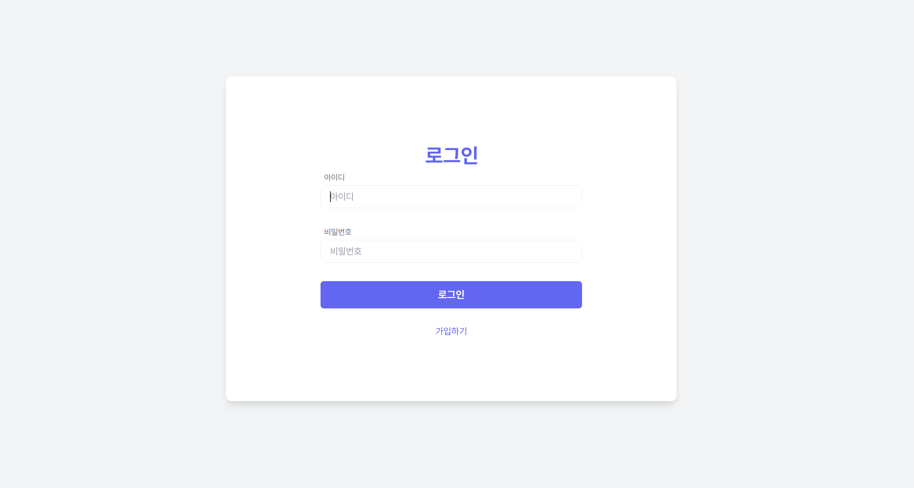
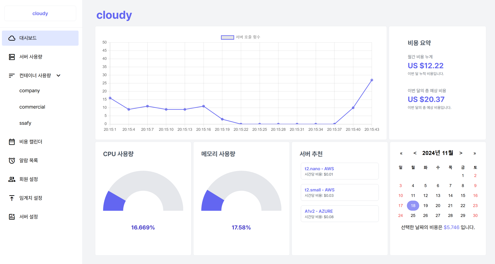
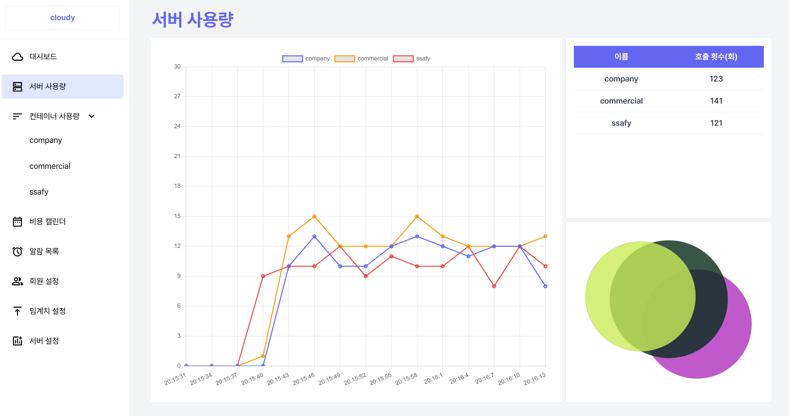
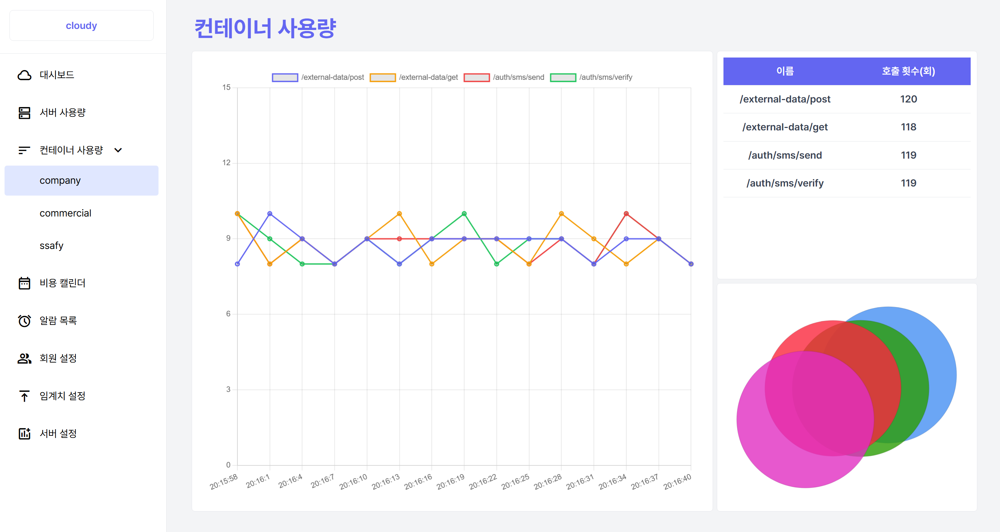
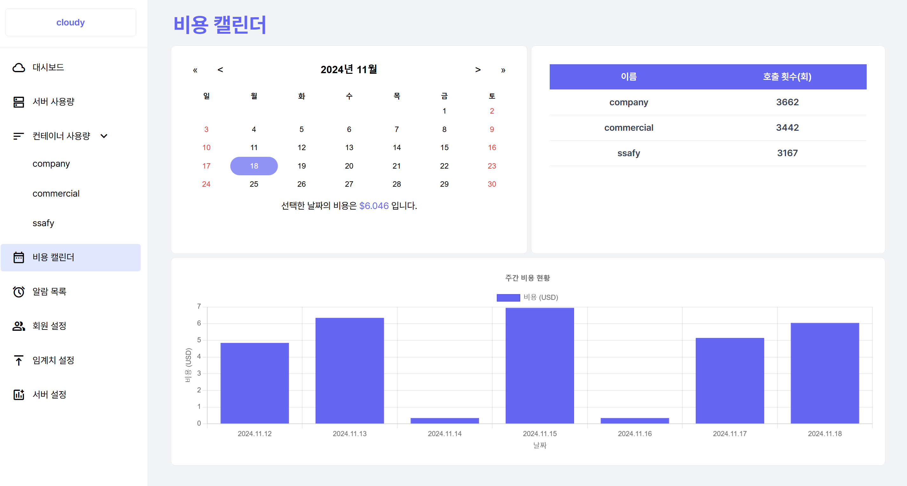
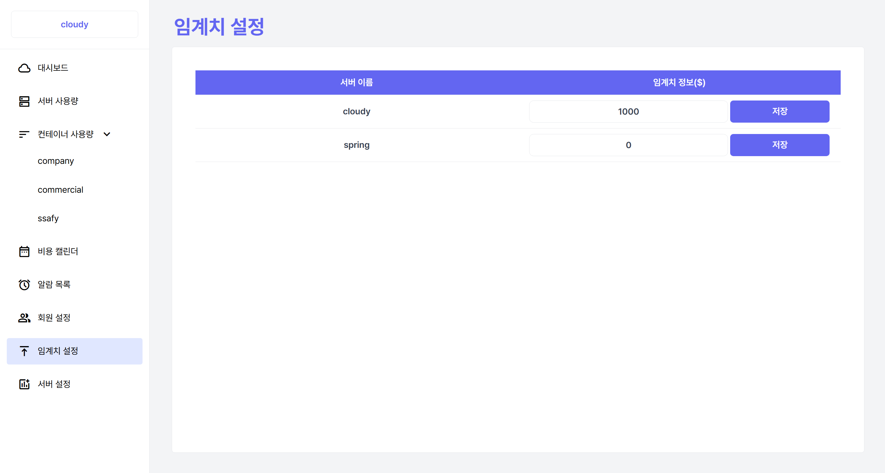
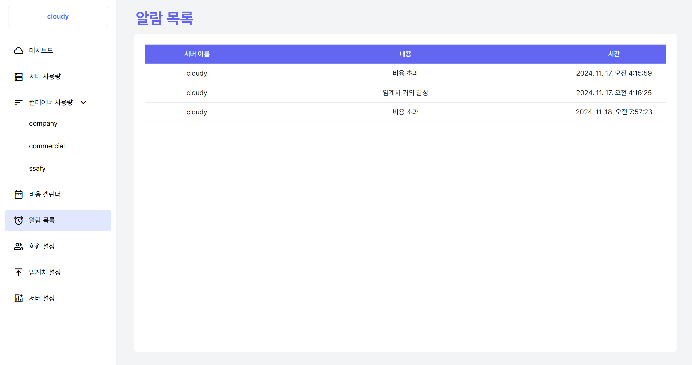
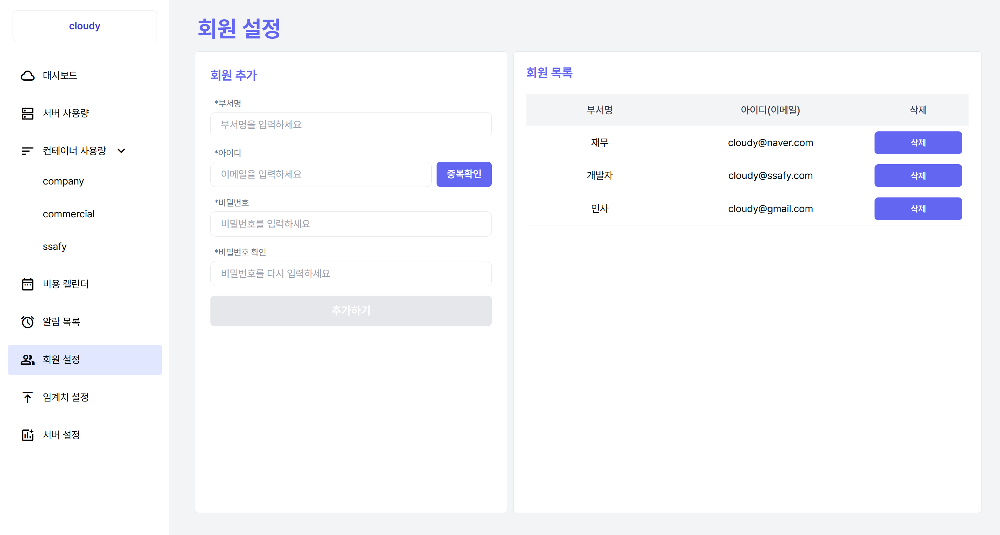
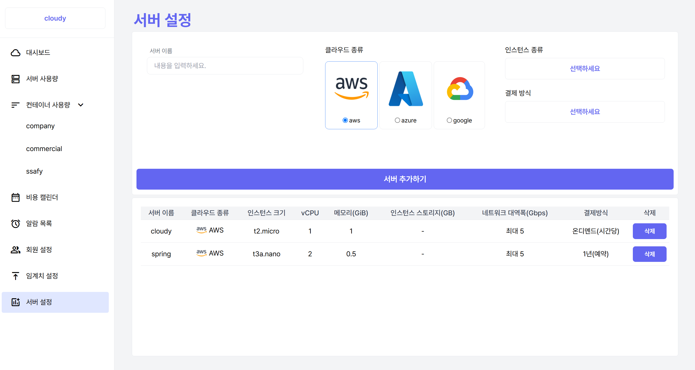

## 시연순서 시나리오
1) 로그인화면에서 시작합니다.

2) 메인 화면의 대시보드, 서버의 사용량, 서버추천, 서버 비용 요약을 보여줍니다.

3) 서버 사용량 화면에서 서버 컨테이너의 사용량을 확인합니다.

4) 컨테이너 사용량 화면에서 각 컨테이너의 서비스 사용량을 확인합니다.

5) 최근 일주일 컨테이너 사용 내역과 비용을 보여줍니다.

6) 임계치 설정 화면입니다.

7) 알림 목록 화면입니다. 설정한 임계치를 넘어가면 알람이 발송됩니다.

8) 회원 설정 화면입니다. 일반 계정을 추가하며 서버의 사용량 및 비용을 확인할 수 있습니다.

9) 서버 설정 화면입니다. 서버를 추가하거나 삭제할 수 있습니다.

